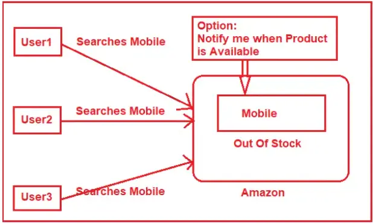
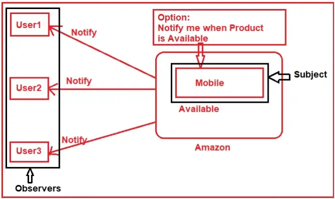

# Observer Design Pattern

## Introduction
Observer pattern is used when there is one-to-many relationship between objects such as if one object is modified, its dependent objects are to be notified automatically. Observer pattern falls under behavioural pattern category.

The Observer design pattern is a behavioral pattern that defines a dependency relationship between objects, where one object, known as the subject or the observable, maintains a list of dependents, known as observers. When the state of the subject changes, it notifies all registered observers, allowing them to update or react accordingly. The pattern consists of two primary components: the subject and the observer. The subject defines the interface for managing observers and broadcasting state changes, while the observer defines the interface for receiving notifications. Multiple observers can be registered with a single subject, establishing a dynamic relationship that allows for flexible and efficient communication between objects.

### Example to Understand Observer Design Pattern:

Let us understand the Observer Design Pattern with one Real-Time Example. Please have a look at the following diagram. Here, we are taking the example of the Amazon ECommerce Application.

As you can see in the above image, three users come to the Amazon site for buying a Mobile Phone. Unfortunately, at that time the Mobile phone is out of stock i.e. the mobile is in the Out Of Stock state. But the above three users want to buy that particular mobile phone. On the Amazon website site, there is an option called Notify Me when the product is not available in stock. What the above three users do is, simply click on the Notify Me button, so that when the product is available, the Amazon site will send a notification to them.

After a few days, the Product is available, and so the status of the Product is changed from Out of Stock to Available. So, what Amazon will do is send notifications to all the users who are registered with that particular product to get product available notifications. As we already discussed the Observer Design Pattern has two main components i.e. the Subject and the Observer. In our examples, the Mobile is the Subject and three users (i.e. User1, User2, and User3) are the Observers. For a better understanding please have a look at the following image.

As per the Observer Design Pattern, the Observers need to be registered with the Subject. In our case, the three users are registered to the notification option of the Subject. When the state changes i.e. Out of Stock to Available the Subject will send a notification to all the subscribers. 

