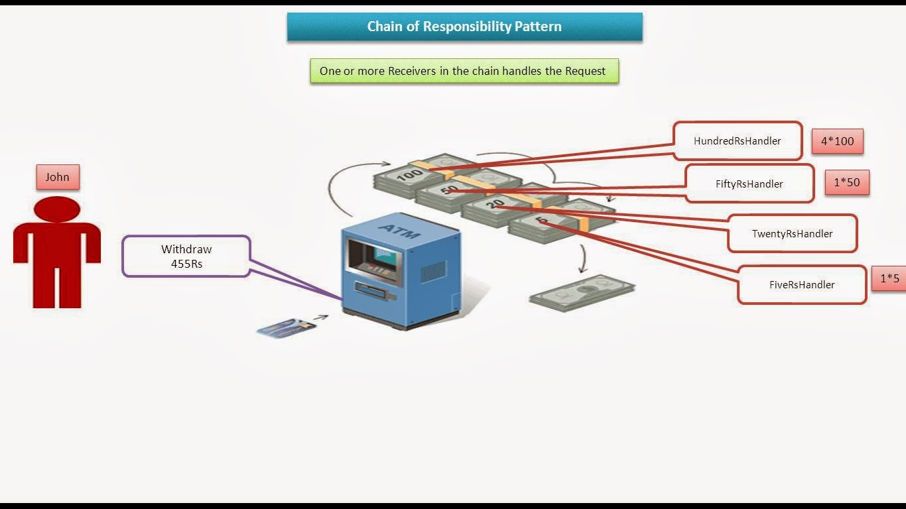

# Chain of Responsibility Design Pattern

Chain of Responsibility Pattern or Chain of Responsibility Method is a Behavioral Design Pattern, which allows an object to send a request to other objects without knowing who is going to handle it.
- This pattern is frequently used in the chain of multiple objects, where each object either handles the request or passes it on to the next object in the chain if it is unable to handle that request.
- This pattern encourages loose coupling between sender and receiver, providing freedom in handling the request.

## Characteristics of the Chain of Responsibility Design Pattern
- **Loose Coupling:** The pattern promotes loose coupling between the sender and receiver of a request, as the sender doesn’t need to know which object will handle the request and the receiver doesn’t need to know the structure of the chain.
- **Dynamic Chain:** The chain can be modified dynamically at runtime, allowing for flexibility in adding or removing handlers without affecting the client code.
- **Single Responsibility Principle:** Each handler in the chain has a single responsibility, either handling the request or passing it to the next handler, which helps in maintaining a clean and modular design.
- **Sequential Order:** Requests are processed sequentially along the chain, ensuring that each request is handled in a predefined order.
- **Fallback Mechanism:** The chain can include a mechanism to handle requests that are not handled by any handler in the chain, providing a fallback or default behavior.
- **Variants:** The pattern has variants like a linear chain, where each handler has a single successor, or a tree-like structure, where a handler can have multiple successors, allowing for more complex processing logic.
- **Enhanced Flexibility:** The pattern allows for enhanced flexibility in handling requests, as the chain can be configured or modified to suit different requirements without changing the client code.

## Benefit of Using the Chain of Responsibility in this scenario:
The Chain of Responsibility pattern is beneficial in this situation because it allows us to create a chain of handlers, where each handler can either handle a request or pass it to the next handler in the chain. This way, we can easily add or remove handlers without modifying the client code, providing flexibility and scalability in handling customer requests.

## Components of the Chain of Responsibility Design Pattern
The Chain of Responsibility Pattern consists of the following key components:
1. **Handler Interface or Abstract Class:**
   This is the base class that defines the interface for handling requests and, in many cases, for chaining to the next handler in the sequence.
2. **Concrete Handlers:**
   These are the classes that implement how the requests are going to be handled. They can handle the request or pass it to the next handler in the chain if it is unable to handle that request.
3. **Client:**
   The request is sent by the client, who then forwards it to the chain’s first handler. Which handler will finally handle the request is unknown to the client.

## Chain of Responsibility Design Pattern Example

